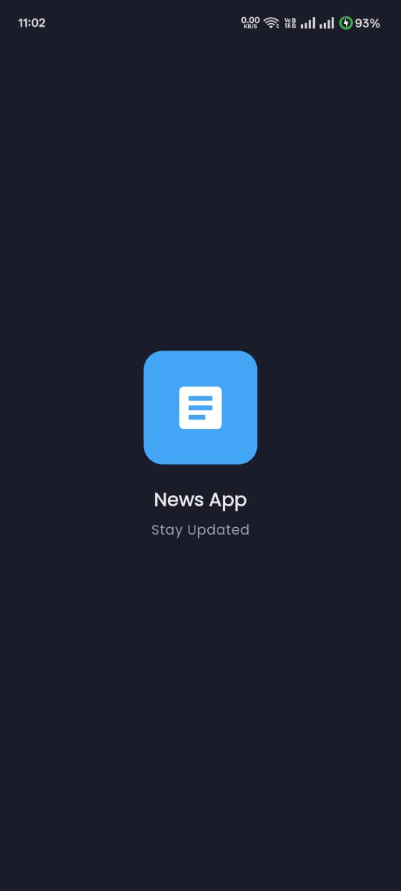
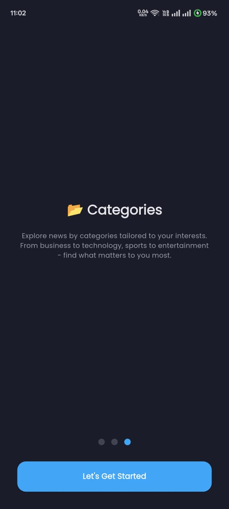
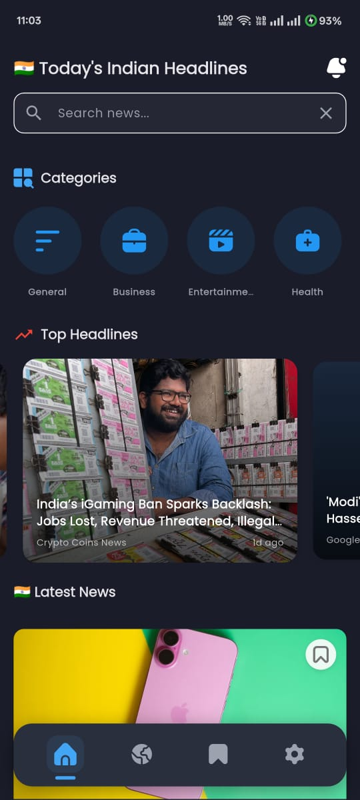
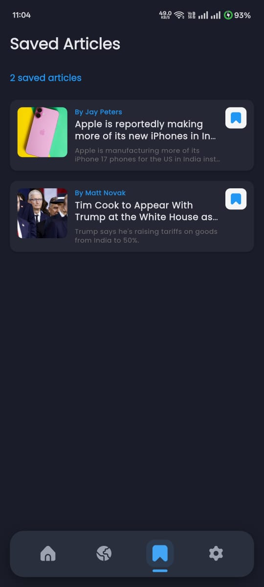
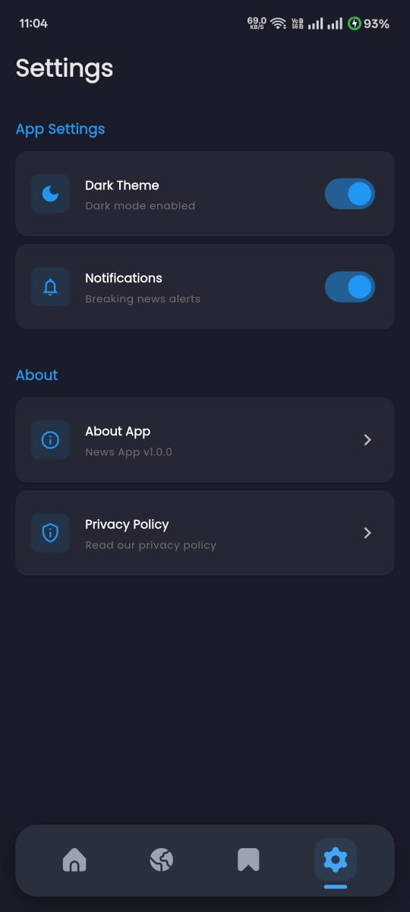
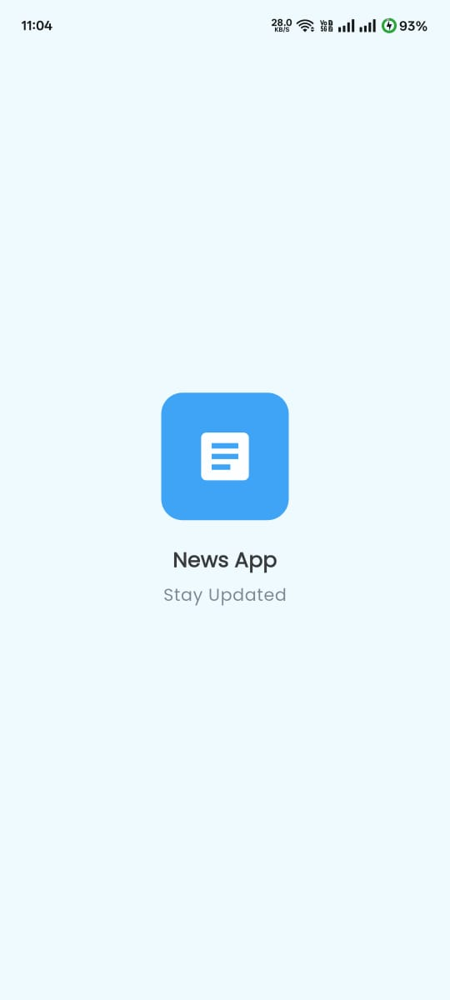
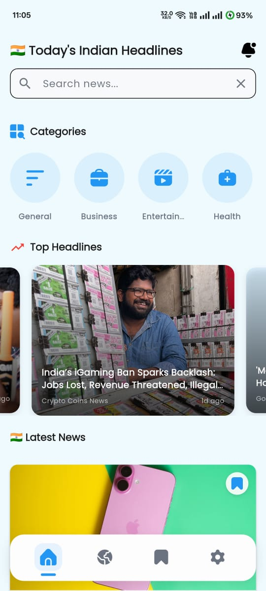
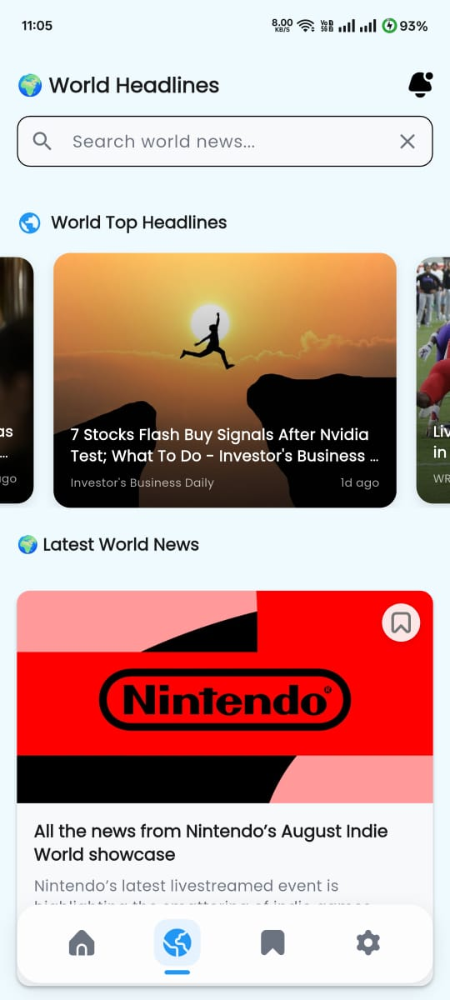
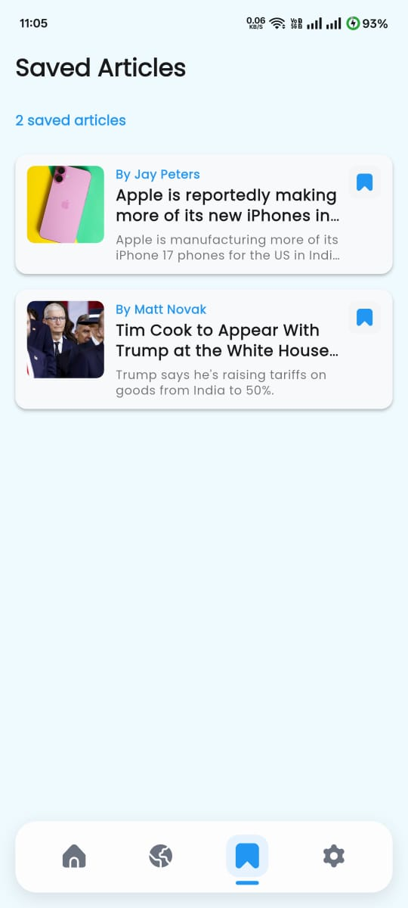
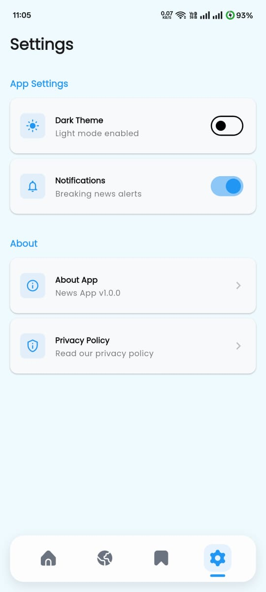

# 📰 News App  


---

**News App** is a **modern Flutter application** with a **beautiful UI** that delivers the latest news using the **NewsAPI**.  
The app features **smooth navigation with custom page transitions**, **offline bookmark support**, and **light/dark theme modes** for the best user experience.

---

## ✨ Features
- 📰 **Fetch Latest News** using [NewsAPI](https://newsapi.org/)  
- 📂 **Browse News by Categories** (Business, Sports, Technology, etc.)  
- 🔍 **Search News** by keyword  
- 💾 **Bookmark Articles** to read later (local storage)  
- 🌗 **Light & Dark Mode** for an adaptive experience  
- 🔀 **Smooth Page Transitions** for a premium feel  
- ⚡ **Optimized Network Calls using Dio**  
- 🏗 **State Management using BLoC** for scalability  

---


## 🛠 Tech Stack
- **Flutter (Dart)** – UI framework  
- **BLoC (flutter_bloc)** – State management  
- **Equatable** – Value comparison for BLoC states/events  
- **Dio** – Network requests and API handling
- **Connectivity Plus** – Check and handle internet connectivity for a smooth user experience
- **Cached Network Image** – Optimized image caching and loading  
- **Google Fonts** – Beautiful typography  
- **Flutter Dotenv** – Environment variable management (API keys)  
- **Flutter SVG** – SVG image support for icons and illustrations  
- **Carousel Slider** – Smooth image sliders for headlines  
- **Shared Preferences** – Persistent local storage (onboarding & bookmarks)  
- **Smooth Page Indicator** – Modern page indicators for onboarding  
- **Easy Animated Indexed Stack** – Animated navigation between screens  

---

## 📱 Screenshots

<details>
<summary>🌙 Dark Mode</summary>

### 📰 Onboarding Screens
<p>
  
  
  
  
</p>

### 📰 App Screens
<p>
  
  
  
  
  
  
</p>

</details>

<details>
<summary>🌞 Light Mode</summary>

### 📰 App Screens
<p>
  
  
  
  
  
  
  

</p>

</details>

---

## 🚀 Getting Started

### ✅ Prerequisites
- Install the **Flutter SDK** and set up your environment  
- An IDE like **Android Studio** or **VS Code**  
- An emulator/simulator or a physical device  

### ✅ Steps to Run
1. **Clone the repository**
   ```bash
   git clone https://github.com/Aquib-ig/News-App.git
   cd News-App
2. **Install dependencies**
   ```bash
   flutter pub get
   ```
3. **(Optional) Verify your setup**
   ```bash
   flutter doctor
   ```
4. **Run the app**
   ```bash
   flutter run
   ```

### 📦 Build (optional)
- **Android (release APK)**
  ```bash
  flutter build apk --release
  ```
- **iOS (release)**
  ```bash
  flutter build ios --release
  ```
  > On macOS with Xcode configured.

---

## 👨‍💻 Author

**Aquib Khan**  
- GitHub: [Aquib-ig](https://github.com/Aquib-ig)  
- LinkedIn: [Aquib Khan](https://www.linkedin.com/in/aquib-khan-454049253)

---
